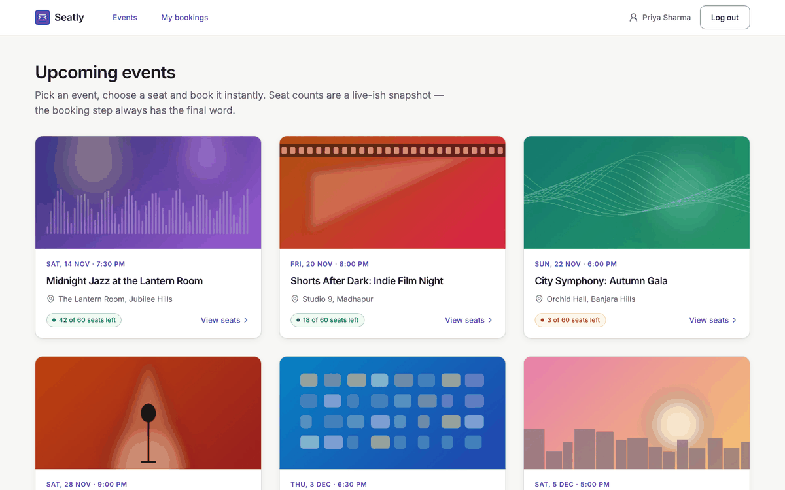
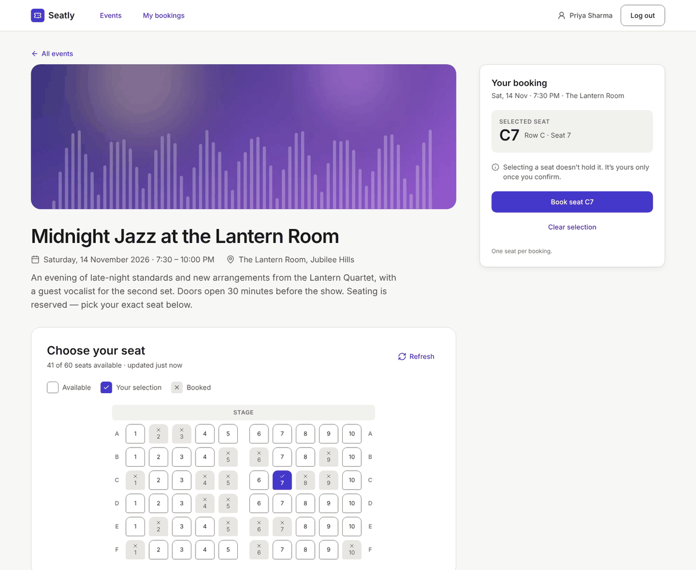
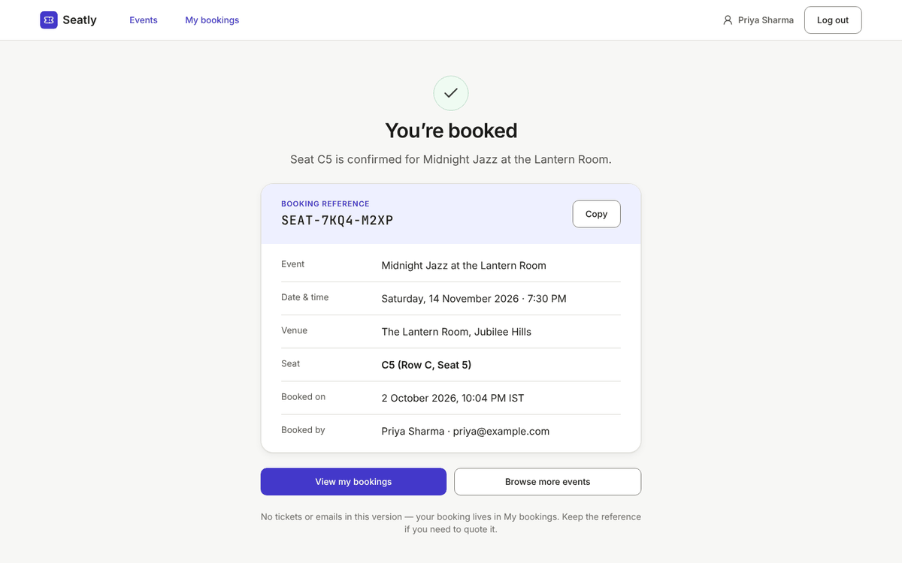
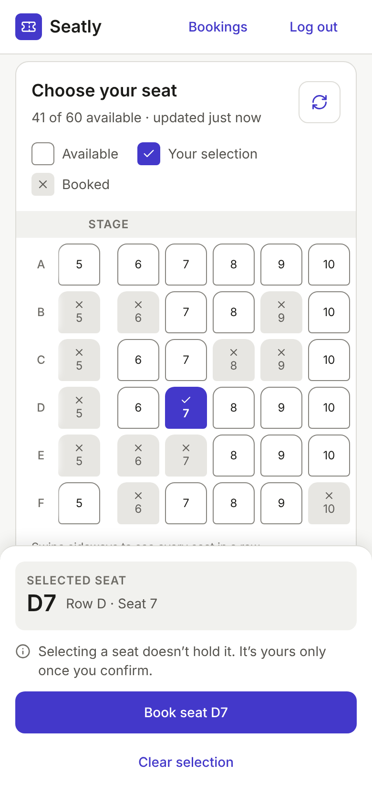
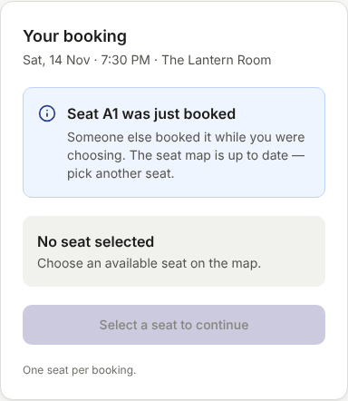

# Seatly

**Find your event. Secure your seat.**

[](https://github.com/uchiha-suraj/Seatly/actions/workflows/ci.yml)

Seatly is a full-stack event-booking app built around one hard problem: **one available seat, hundreds of competing users, exactly one successful booking.** The interesting part is not the catalogue but the guarantees: no double bookings under concurrency, safe retries over a flaky network, and a UI that tells people the truth about what happened.

- **Live demo:** https://seatly-02yb.onrender.com (free Render instance: the first request after a quiet period can take about 50 s)
- **Design (Figma):** [Seatly V1 — design system, 7 screens at 1440 and 390 px, 29 state frames](https://www.figma.com/design/idjCTBnahtTeUNDxIVyHKa)

| Event list | Seat selection |
| --- | --- |
|  |  |

| Booking confirmed | Mobile seat map | Seat taken while choosing |
| --- | --- | --- |
|  |  |  |

## What V1 does

- Browse upcoming events with live seat counts; open an event and pick a seat on a keyboard-accessible seat map (roving focus, arrow keys, Home/End).
- Register, log in and log out with a cookie session. A seat chosen before logging in is kept only as *intent*: after login, availability is re-checked and the seat stays selected only if it is still free.
- Book exactly one seat per request. Every booking carries an idempotency key, so retries after a timeout or dropped connection can never create a second booking.
- See the result clearly: confirmation page with a booking reference, "seat just taken" when someone else won, "still checking" while a retry is in progress, and "we couldn't confirm" with a safe way to check.
- **Live seat map:** while the page is visible it refreshes every 10 s and when the window regains focus; if the selected seat gets booked by someone else, the selection is cleared with a notice.
- My bookings and booking details, visible only to their owner.
- Responsive from 390 px to 1440 px, matching the Figma file.

Out of scope for V1: payments, holds or seat locking, admin tools, emails or tickets.

## Stack

| Layer | Stack |
| --- | --- |
| Web | React 19, Vite 8, TypeScript, Tailwind 4, React Router 8, TanStack Query 5 |
| API | Node 24, Express 5, TypeScript, Zod 4, argon2, helmet, pino |
| Data | MongoDB 8 replica set (transactions), Mongoose 9 |
| Tests | Vitest 5, React Testing Library, MSW, supertest against a real MongoDB |
| Hosting | Render (one web service) + MongoDB Atlas |

## How a booking stays correct

`POST /api/bookings` with body `{ "eventId": "…", "seatId": "C7" }` and an `Idempotency-Key: <uuid>` header. The user comes from the session cookie only; a `userId` in the body is rejected by the strict schema.

**Database guarantees (the real defence)**

1. **Atomic conditional claim:** `Seat.findOneAndUpdate({ event, seatId, status: 'available' }, { status: 'booked', … })`. Of N concurrent claims, MongoDB lets exactly one match.
2. **Unique index** on `bookings (event, seatId)`: a second booking for a seat cannot be written even if the code were wrong.
3. **One transaction** (snapshot read concern, majority write concern) wraps the seat claim, the booking insert and the idempotency-key completion. Either all three commit or none do.

**Request flow** (`apps/api/src/modules/bookings/service.ts`)

| Phase | Work | Outcome |
| --- | --- | --- |
| 0 | Auth, origin check, JSON, Zod validation | 401 / 403 / 415 / 422 |
| 1 | Insert the idempotency key `(user, key)` with a fingerprint, a 15 s lease and an `attemptId` fencing token | See idempotency table |
| 2 | Fast reads: event missing / seat missing / seat already booked | Final 404 / 409 `SEAT_TAKEN`, stored on the key |
| 3 | Transaction loop: ≤5 attempts within a 4 s deadline, jittered backoff, commit retried on `UnknownTransactionCommitResult` | 201 booking, or 409 `SEAT_TAKEN` |
| 4 | Non-final failure: fenced release of the key | 503 `BOOKING_UNAVAILABLE` (retryable with the same key) |

If a commit outcome is unknown the key is **not** released, so a retry cannot double-book; the lease expiry decides.

**Idempotency rules** (keys are scoped per user, kept 24 h)

| Same key arrives and… | Response |
| --- | --- |
| payload fingerprint differs | 422 `IDEMPOTENCY_KEY_REUSED` |
| first request completed | Stored response replayed, header `Idempotent-Replayed: true` |
| first request still running (lease valid) | 409 `IDEMPOTENCY_IN_PROGRESS`, `Retry-After: 1` |
| lease expired (crashed worker) | Takeover with a new `attemptId`; the old worker's writes are fenced out |

**Client behaviour:** 10 s timeout; on timeout, network error or 503 it retries automatically at +1 s and +3 s (+0–250 ms jitter) **with the same key**; `IN_PROGRESS` is polled up to 5 times on a separate budget. The key lives in `sessionStorage` until the outcome is known, so a page refresh resumes the same attempt. A new key is created only for a new seat choice.

**Live seat map:** re-fetched every 10 s while the page is visible and whenever the window regains focus; hidden tabs don't poll, and polling pauses while a booking request is in flight. This only keeps the display fresh: availability on screen is advisory, and the server's conditional update decides every booking.

## Verified results

Measured on 2 Oct 2026. These are correctness checks on one machine, **not** a capacity benchmark.

| Check | Result |
| --- | --- |
| Concurrency demo: 100 users, distinct keys, one seat, 2 API processes | 1 × 201, 99 × 409 `SEAT_TAKEN`, 0 errors, 1 booking in MongoDB |
| Idempotency demo: replay, payload conflict, 20 simultaneous same-key requests | 7/7 checks pass: one booking, others 409 `IN_PROGRESS`, follow-up replays it |
| API integration suite against a real replica set | Auth, events, bookings, idempotency, injected MongoDB faults, 50-user race |
| Unit + web suites | 75 tests (schemas, crypto, config, seat map, booking states, retries, polling) |
| Live deployment | Health check on Atlas, event data, auth errors, booking and second-user conflict verified on the live site |

## Run it locally

Prerequisites: Node `24` (see `.nvmrc`; 22.22.2+ also works) and Docker (for MongoDB).

```bash
cp .env.example .env          # local defaults; never commit .env
npm ci
npm run db:up                 # single-node replica set rs0 on :27017, waits for a primary
npm run db:check              # confirms a replica set with a writable primary
npm run seed                  # 7 events (incl. the 1-seat "demo-last-seat")
npm run dev                   # API on :4000, web on :5173 (proxied /api)
```

Open http://localhost:5173.

> **Why a replica set?** MongoDB multi-document transactions only run on a replica set or a sharded cluster. `docker-compose.yml` starts a one-node set and its healthcheck runs `docker/mongo-init.js` (an idempotent `rs.initiate`), so `db:up` returns only when the node is writable.

### Scripts

| Command | What it does |
| --- | --- |
| `npm run dev` | API (tsx watch) + web (Vite) |
| `npm run build` | Web `dist/` + bundled API `apps/api/dist/server.js` |
| `npm start` | Built API; serves the web build too when `SERVE_WEB_DIST=true` |
| `npm run start:two` | Two API processes on :4001 and :4002 (works on Windows too) |
| `npm run lint` / `typecheck` | ESLint (flat config) / `tsc` in every workspace |
| `npm test` | Unit → API integration → web |
| `npm run test:unit` | Shared schemas + API pure units (no DB) |
| `npm run test:api` | API integration tests (**needs the replica set**) |
| `npm run test:web` | Component and flow tests with an MSW fake API |
| `npm run db:up` / `db:down` / `db:reset` | Start / stop / wipe MongoDB |
| `npm run demo:concurrency` | Many users race for one seat (see below) |
| `npm run demo:idempotency` | Same-key replay / conflict / in-progress demo |

### Concurrency demonstration

```bash
# terminal 1 (DEMO_MODE=true in .env)
npm run build && npm run start:two
# terminal 2
npm run demo:concurrency -- --users 100 --targets http://localhost:4001,http://localhost:4002
npm run demo:idempotency -- --targets http://localhost:4001
```

The demo checks both APIs are up, resets the 1-seat event, logs in N users (not timed), releases all requests at once, then queries MongoDB directly. It writes `demo-results/*.json` and exits non-zero unless there is exactly one success, one persisted booking and zero unexpected responses. There is no load-test button in the UI, and the demos never run against the live site.

## API

| Method | Path | Auth | Purpose |
| --- | --- | --- | --- |
| GET | `/api/health` | – | Database ping and replica-set name |
| POST | `/api/auth/register` · `/api/auth/login` | – | Create account / log in; sets the session cookie |
| POST | `/api/auth/logout` | – | Ends the session (idempotent) |
| GET | `/api/auth/me` | ✓ | Current user |
| GET | `/api/events` · `/api/events/:id` | – | Events with availability; event details and layout |
| GET | `/api/events/:id/seats` | – | Seat snapshot (`no-store`) |
| POST | `/api/bookings` | ✓ | Book a seat (requires `Idempotency-Key`) |
| GET | `/api/bookings/:id` | ✓ | One booking (404 if it isn't yours) |
| GET | `/api/me/bookings` | ✓ | My bookings, newest first |

Errors use one envelope: `{ "error": { "code", "message", "details", "requestId" } }`.

## Repository layout

```
apps/
  api/        Express API, Mongoose models, booking service, scripts, tests
  web/        React SPA (features/: auth, events, booking, bookings)
packages/
  shared/     Zod schemas, error codes, DTO types used by both apps
docker/       mongo-init.js (replica-set bootstrap)
docs/         README screenshots
.github/      CI: lint, typecheck, all tests, build, concurrency smoke demo
render.yaml   Render Blueprint (the live deployment)
```

## Tests

- `packages/shared/test`: schema edge cases (seat IDs, strict bodies, UUID keys).
- `apps/api/test/unit`: crypto helpers, error mapping, config parsing (including production safety checks).
- `apps/api/test/integration`: against a real replica set, one database per worker: `auth`, `events`, `bookings` (ownership: other users get 404), `idempotency`, `transaction-failures` (MongoDB `failCommand` fail points and injected fault points: transient errors, unknown commit result, primary shutdown during commit, lease takeover, crash after commit), `concurrency` (50 users, one seat, exactly one booking).
- `apps/web/test`: seat-map keyboard navigation, booking states, same-key retries, login-intent restore, live polling, header.

After every integration test, a check scans the whole database: a seat is booked if and only if exactly one booking points to it. The integration suite refuses to run without a replica set and says why.

## Deployment

One Render web service runs the API and serves the built React app from the same origin, so the session cookie stays first-party. MongoDB Atlas provides the replica set (every Atlas cluster, including the free tier, is one).

1. **Atlas:** create a project and a free cluster, a database user with a generated password, and a Network Access entry. Render's free plan has no fixed outbound IP, so this entry is `0.0.0.0/0`; the strong password is what protects the database. Use the connection string with the database name: `mongodb+srv://<user>:<password>@<cluster>/seatly?retryWrites=true&w=majority`.
2. **Seed Atlas from your machine** (Render's free plan has no shell). A variable set on the command line overrides `.env`:
   ```bash
   MONGODB_URI='…' npm run db:check
   MONGODB_URI='…' npm run seed
   ```
   On Windows, if Node fails with `querySrv ECONNREFUSED`, use Atlas's standard `mongodb://host1,host2,host3/seatly?tls=true&replicaSet=…&authSource=admin` string locally. Render itself uses the `+srv` string.
3. **Render:** New → Blueprint → pick this repository. `render.yaml` creates the `seatly` service; set the two secrets when asked: `MONGODB_URI` and `APP_ORIGIN` (the exact service URL, no trailing slash).
4. **Check:** `/api/health` returns `{"status":"ok","db":"ok","replicaSet":"…"}`; then register, book a seat and open My bookings.

Notes: the build installs devDependencies on purpose (`npm ci --include=dev`), because `NODE_ENV=production` would otherwise skip the build tools. In production the API refuses to start without `APP_ORIGIN` or with `COOKIE_SECURE` off. `DEMO_MODE` stays `false`: the demo scripts reset data and are for local runs only.

## Security notes

- Opaque 256-bit session token in an `HttpOnly`, `SameSite=Lax` cookie (`Secure` in production); only its SHA-256 hash is stored. Idle timeout 120 min, absolute 7 days, rotated on login.
- Passwords hashed with argon2id; login timing equalised for unknown emails.
- Mutating requests need the allowed `Origin`; JSON only; helmet CSP; auth rate limit.
- Secrets live in `.env` (git-ignored) and in Render's environment settings. `.env.example` holds safe local defaults only.

## How it was built

The project went through six reviewed stages: requirements and acceptance criteria, Figma design, technical plan, implementation in vertical slices, verification against a real replica set, and deployment.

## Credits

See [CREDITS.md](CREDITS.md).
